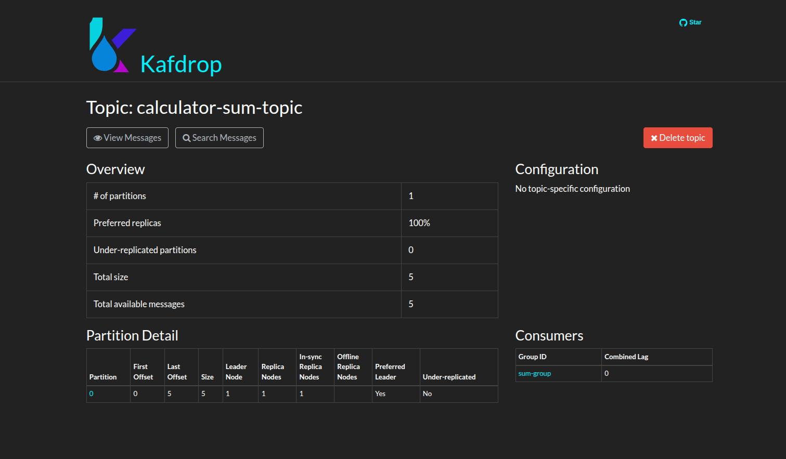
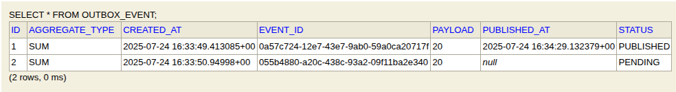

# 🧮 Distributed Sum System

A distributed system built with **Java**, **Spring Boot**, and **Apache Kafka** to perform a simple arithmetic operation — the sum of two numbers — using **gRPC**, **REST APIs**, and **asynchronous messaging**.  
Includes observability and performance testing integrations for production-grade deployments.

---

## 📁 Project Structure

```
distributed-sum-system/
├── calculator-service-grpc/   # gRPC service to send data to Kafka
├── sum-rest-service/          # REST service to consume and persist the sum
├── docker-compose.yml         # Kafka, Zookeeper, Kafdrop setup
└── README.md
```
---
## 📌 Architecture Flow:

```sql
           ┌────────────────────┐
           │                    │
           │ gRPC Client (e.g., │
           │ grpcurl/Postman)   │
           │                    │
           └────────┬───────────┘
                    │
                    ▼
     ┌─────────────────────────────┐
     │  calculator-service-grpc    │
     │  (gRPC Server + Kafka Prod) │
     └────────────┬────────────────┘
                  │
          ┌───────▼────────┐
          │  Outbox Table  │◄───┐
          └───────┬────────┘    │
                  │             │ DB Transaction
          ┌───────▼────────┐    │
          │  Outbox Poller │────┘
          └───────┬────────┘
                  │
                  ▼
         ┌────────────────┐
         │ Apache Kafka   │◄─────┐
         │ Topic:         │      │
         │ calculator-sum │      │
         └───────┬────────┘      │
                 │               │
 ┌───────────────▼────────────┐  │
 │   sum-rest-service         │  │
 │   (Kafka Consumer + File)  │  │
 └──────────┬─────────────────┘  │
            │                    │
            ▼                    │
     ┌───────────────┐           │
     │   sum.txt     │           │
     └───────────────┘           │
            ▲                    │
            │ GET /total         │
            │                    │
    ┌───────┴────────┐           │
    │    REST Client │           │
    └────────────────┘           │

Monitoring & Observability:
─────────────────────────────────────

    ┌──────────────┐     ┌──────────────┐
    │  Prometheus  │◄────│  REST + gRPC │  <-- Export metrics (Micrometer)
    └────┬─────────┘     └──────────────┘
         │
         ▼
   ┌──────────────┐
   │   Grafana    │
   └──────────────┘

Performance Testing:
────────────────────

   ┌──────────────┐
   │     k6       │ ---> Load test gRPC/REST endpoints
   └──────────────┘
```

---

## ⚙️ Tech Stack

| Layer         | Technology                  |
|---------------|-----------------------------|
| Language      | Java 17                     |
| Framework     | Spring Boot 3.2+            |
| RPC Protocol  | gRPC                        |
| REST API      | Spring Web MVC              |
| Messaging     | Apache Kafka                |
| Dashboard     | Kafdrop                     |
| Monitoring    | Prometheus, Grafana (TBD)   |
| Performance   | k6                          |
| Build Tools   | Gradle (gRPC), Maven (REST) |

---

## 📦 Services Overview

### 1. `calculator-service-grpc`

- gRPC service that exposes an `Add` RPC method.
- Accepts two integers and publishes them as a Kafka message to `calculator-sum-topic`.

✅ Features:
- gRPC server on `localhost:9090`
- Kafka **producer** integration
- Outbox pattern for reliable delivery

---

### 2. `sum-rest-service`

- Spring Boot REST API to return the current total sum.
- Acts as Kafka **consumer**, listens to `calculator-sum-topic`.
- Persists the sum in a simple file-based store (`sum.txt`).

✅ Endpoints:
- `GET /total` – Returns the current total

---

## 🧪 Run the Project Locally

### 1. Start Kafka & Kafdrop (Docker)

```bash
docker-compose up -d
```

This will spin up:
- **Zookeeper** on port `2181`
- **Kafka Broker** on port `9092`
- **Kafdrop UI** on port `9000`

---

### 2. Start gRPC Producer

```bash
cd calculator-service-grpc
./gradlew bootRun
```

Test using `grpcurl`:

```bash
grpcurl -plaintext -d '{"num1": 5, "num2": 10}' localhost:9090 CalculatorService/Add
```

---

### 3. Start REST Consumer

```bash
cd sum-rest-service
./mvnw spring-boot:run
```

Access the API:

```bash
curl http://localhost:8080/total
```

---

## 🔍 Kafka Dashboard – Kafdrop

Kafka UI is available at:

**➡️ http://localhost:9000**

Browse Kafka topics, inspect partitions, and view message payloads.



---

## ✅ Outbox Pattern (Implemented)

Outbox pattern has been successfully implemented in `calculator-service-grpc` to ensure **reliable message delivery**.

### 🧩 How It Works:

1. When a gRPC request is received (e.g., `Add`), the event is first saved to an **outbox_event** table.
2. A background **outbox poller** scans the table periodically:
   - Reads `PENDING` events
   - Publishes them to Kafka (`calculator-sum-topic`)
   - Updates the status to `PUBLISHED`

### 🗃️ Table Structure:

```sql
CREATE TABLE outbox_event (
    id BIGINT AUTO_INCREMENT PRIMARY KEY,
    event_id VARCHAR(255),
    aggregate_type VARCHAR(255),
    payload CLOB,
    status VARCHAR(50),
    created_at TIMESTAMP,
    published_at TIMESTAMP
);
```

### 📸 Screenshot – H2 Outbox Table:



---

## 🗺️ Roadmap

- [x] Implement gRPC CalculatorService with Add RPC
- [x] Expose REST `GET /total` to read sum from file
- [x] Add Kafka producer to gRPC service
- [x] Add Kafka consumer to REST service
- [x] Add Kafdrop for Kafka message inspection
- [x] Implement Outbox Pattern for safe Kafka publishing
- [ ] Add Prometheus + Grafana for monitoring
- [ ] Run k6 load tests and report metrics
- [ ] Use Kubernetes cluster for deployment

---

## 👨‍💻 Author

**Sameh Tarek** – Backend Engineer
[GitHub](https://github.com/sameh-tarek) • [LinkedIn](https://www.linkedin.com/in/sameh-tarek-mohamed-766a0a234/)