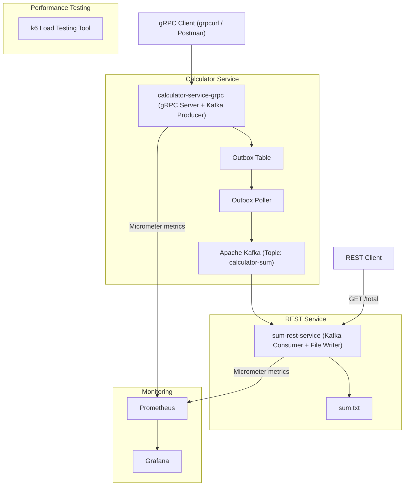
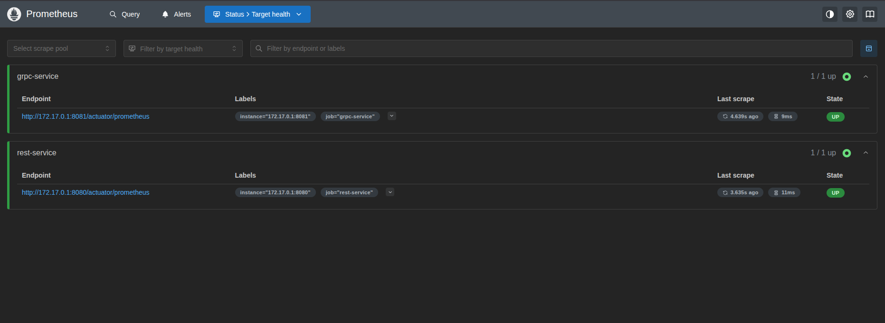
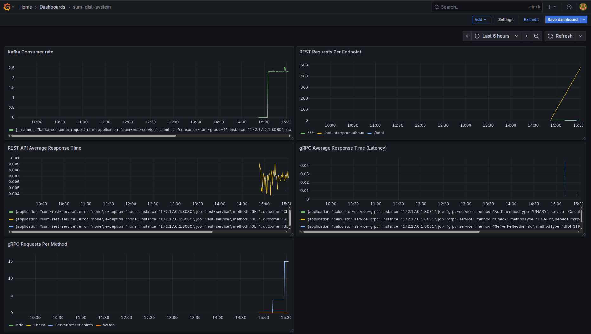

# 🧮 Distributed Sum System

A distributed system built with **Java**, **Spring Boot**, and **Apache Kafka** to perform a simple arithmetic operation — the sum of two numbers — using **gRPC**, **REST APIs**, and **asynchronous messaging**.  
Includes observability and performance testing integrations for production-grade deployments.

---

## 📁 Project Structure

```
distributed-sum-system/
├── calculator-service-grpc/ # gRPC service to send data to Kafka
├── sum-rest-service/ # REST service to consume and persist the sum
├── docker-compose.yml # Kafka, Zookeeper, Prometheus, Grafana, Kafdrop setup
├── prometheus.yml # Prometheus scrape configuration for REST & gRPC services
└── README.md
```

---



---

## ⚙️ Tech Stack

| Layer           | Technology                  |
|-----------------|-----------------------------|
| Language        | Java 17                     |
| Framework       | Spring Boot 3.2+            |
| RPC Protocol    | gRPC                        |
| REST API        | Spring Web MVC              |
| Messaging       | Apache Kafka                |
| kafka Dashboard | Kafdrop                     |
| Monitoring      | Prometheus, Grafana         |
| Performance     | k6                          |
| Build Tools     | Gradle (gRPC), Maven (REST) |

---

## 📦 Services Overview

### 1. `calculator-service-grpc`

- gRPC service that exposes an `Add` RPC method.
- Accepts two integers and publishes them as a Kafka message to `calculator-sum-topic`.

✅ Features:
- gRPC server on `localhost:9090`
- Kafka **producer** integration
- Outbox pattern for reliable delivery

### 2. `sum-rest-service`

- Spring Boot REST API to return the current total sum.
- Acts as Kafka **consumer**, listens to `calculator-sum-topic`.
- Persists the sum in a simple file-based store (`sum.txt`).

✅ Endpoints:
- `GET /total` – Returns the current total

---

## 🧪 Run the Project Locally

### 1. Start Kafka & Kafdrop (Docker)

```bash
docker-compose up -d
```

This will spin up:
- **Zookeeper** on port `2181`
- **Kafka Broker** on port `9092`
- **Kafdrop UI** on port `9000`
- **Prometheus** on port `9091`
- **Grafana** on port `3000`

### 2. Start gRPC Producer

```bash
cd calculator-service-grpc
./gradlew bootRun
```

Test using `grpcurl`:

```bash
grpcurl -plaintext -d '{"num1": 5, "num2": 10}' localhost:9090 CalculatorService/Add
```

### 3. Start REST Consumer

```bash
cd sum-rest-service
./mvnw spring-boot:run
```

Access the API:

```bash
curl http://localhost:8080/total
```

---

## 🔍 Kafka Dashboard – Kafdrop

Kafka UI is available at:

**➡️ http://localhost:9000**

Browse Kafka topics, inspect partitions, and view message payloads.


---

## ✅ Outbox Pattern (Implemented)

Outbox pattern has been successfully implemented in `calculator-service-grpc` to ensure **reliable message delivery**.

### 🧩 How It Works:

1. When a gRPC request is received (e.g., `Add`), the event is first saved to an **outbox_event** table.
2. A background **outbox poller** scans the table periodically:
   - Reads `PENDING` events
   - Publishes them to Kafka (`calculator-sum-topic`)
   - Updates the status to `PUBLISHED`

### 🗃️ Table Structure:

```sql
CREATE TABLE outbox_event (
    id BIGINT AUTO_INCREMENT PRIMARY KEY,
    event_id VARCHAR(255),
    aggregate_type VARCHAR(255),
    payload CLOB,
    status VARCHAR(50),
    created_at TIMESTAMP,
    published_at TIMESTAMP
);
```

📸 **Outbox Table Preview:**


---

## 📊 Monitoring & Observability

### ✅ Prometheus

Prometheus collects metrics from both `calculator-service-grpc` and `sum-rest-service` using Micrometer and Spring Boot Actuator.

🔗 **Access Prometheus at:**  
[http://localhost:9091](http://localhost:9091)

📸 **Prometheus Targets View:**



### 📈 Grafana Dashboards

Grafana is used to visualize real-time metrics collected from Prometheus.

🔗 **Access Grafana at:**  
[http://localhost:3000](http://localhost:3000)  
**Username/Password:** `admin / admin`

📸 **Grafana Dashboard Preview:**



### 🔍 Dashboard Panels

| Panel Title                        | Description                              |
|------------------------------------|------------------------------------------|
| `gRPC Requests Per Method`         | Total gRPC requests grouped by method    |
| `gRPC Avg Response Time`           | Latency per gRPC method                  |
| `REST Requests Count`              | HTTP request count grouped by URI        |
| `REST Avg Response Time`           | Average response time for REST endpoints |
| `Kafka Consumer rate` | rate per Kafka consumer group            |

### Example Prometheus Queries

```promql
# gRPC Requests Count by Method
sum(grpc_server_requests_received_messages_total{application="calculator-service-grpc"}) by (method)

# gRPC Avg Latency per Method
rate(grpc_server_processing_duration_seconds_sum{application="calculator-service-grpc"}[1m]) / rate(grpc_server_processing_duration_seconds_count{application="calculator-service-grpc"}[1m])

# REST Request Count
sum(http_server_requests_seconds_count{application="sum-rest-service"}) by (uri)

# REST Average Latency
rate(http_server_requests_seconds_sum{application="sum-rest-service"}[1m]) / rate(http_server_requests_seconds_count{application="sum-rest-service"}[1m])
```

## 🗺️ Roadmap

- [x] Implement gRPC CalculatorService with Add RPC
- [x] Expose REST `GET /total` to read sum from file
- [x] Add Kafka producer to gRPC service
- [x] Add Kafka consumer to REST service
- [x] Add Kafdrop for Kafka message inspection
- [x] Implement Outbox Pattern for safe Kafka publishing
- [x] Add Prometheus + Grafana for monitoring
- [ ] Run k6 load tests and report metrics
- [ ] Use Kubernetes cluster for deployment

---

## 👨‍💻 Author

**Sameh Tarek** – Backend Engineer  
[GitHub](https://github.com/sameh-tarek) • [LinkedIn](https://www.linkedin.com/in/sameh-tarek-mohamed-766a0a234/)
